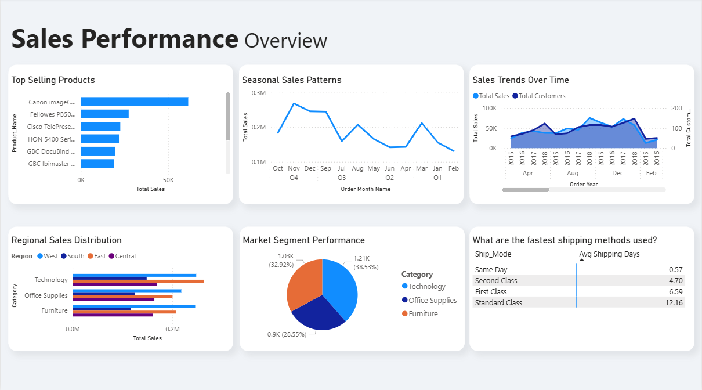

# 📊 Sales Performance Analysis 

##  Project Overview
This project focuses on analyzing sales performance data to uncover key business insights related to product performance, customer behavior, shipping efficiency, and sales trends over time.

The analysis was conducted using **SQL for data cleaning and validation** and **Power BI for data modeling, DAX calculations, and visualization**.

The main objective is to transform raw transactional data into actionable insights that support data-driven business decisions.

---

 ##  Dashboard Preview

.

---

##  Dataset Description
The dataset contains transactional sales records with the following key attributes:
- Order Date & Ship Date  
- Product details (Product Name, Category, Sub-Category)  
- Customer information (Customer ID, Segment, Region)  
- Sales amount  
- Shipping mode  

After inspection and preparation, the data was cleaned and stored in a single table called `Sales_cleaned`, which serves as the main source for analysis.

---

##  Data Cleaning & Preparation (SQL)
Data cleaning was performed using SQL and included:
- Converting date fields into proper date formats  
- Handling missing or null values  
- Ensuring consistent data types  
- Validating data integrity  

---

##  Analytical Questions
This project answers the following business questions:

1. Which products are the best-selling?
2. Which product categories perform best in each region?
3. Is there seasonality in sales performance?
4. Which customer segment is the most valuable?
5. Which shipping method is the fastest based on actual delivery time?
6. How does product performance change year-over-year compared to:
   - The product’s historical average
   - The previous year’s sales
7. How do sales and customer counts change over time?

---

##  Power BI Data Modeling Approach
- A single clean fact table (`Sales_cleaned`) was used.
- No analytical SQL queries were imported into Power BI.
- All aggregations and comparisons were created using **DAX Measures**.
- Calculated columns were created only for date-related attributes (Year, Month).

This approach ensures:
- Flexibility  
- Interactive filtering  
- Better performance and scalability  

---

##  Key Measures (DAX)
Key DAX measures created in Power BI include:
- Total Sales  
- Total Orders  
- Total Customers  
- Average Order Value  
- Month-over-Month (MoM) Change  
- Year-over-Year (YoY) Change  
- Value per Customer  
- Average Shipping Days  
- Yearly Product Sales & Performance Indicators  

All measures are reusable and dynamically respond to filters and slicers.

---

##  Visualizations
The Power BI dashboard includes:
- Bar charts for best-selling products and category performance  
- Line charts for trend and seasonality analysis  
- Bar charts for Regional Sales Distribution
- Pie charts for Market Segment Performance
- Matrix for fastest shipping methods used  
  

Each visualization directly maps to one or more analytical questions.

---

##  Key Insights
- A small subset of products contributes a large portion of total sales  
- Sales exhibit clear seasonal patterns across specific months  
- Customer segments differ significantly in value per customer  
- Faster shipping methods show better delivery performance  
- Product sales performance varies year-over-year, highlighting growth and decline trends  

---

##  Tools & Technologies
- SQL – Data cleaning and validation  
- Power BI – Data modeling, DAX, and visualization  
- DAX – Time intelligence and business logic  

---

##  Conclusion
This project demonstrates a complete end-to-end data analysis workflow:
Raw data → Clean data → Analysis → Insights → Visualization

---

## 👤 Author
- Name: Khalid Alsabei  
- Role: Data Analyst  
- Tools: SQL | Power BI | DAX

 
